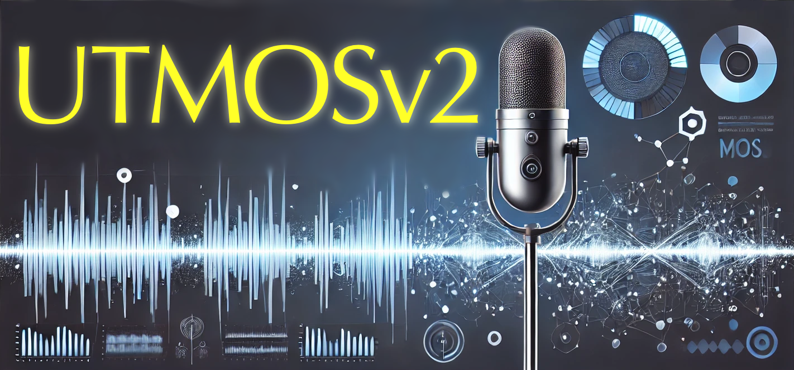

<p align="center">
  
</p>

<h1 align="center">
  UTMOSv2: UTokyo-SaruLab MOS Prediction System
  <a href="https://github.com/charles-alchemcy/UTMOSv2">
    
  </a>
</h1>


<p align="center">
  🎤✨ Official implementation of ✨🎤<br>
  “<a href="http://arxiv.org/abs/2409.09305">The T05 System for The VoiceMOS Challenge 2024:</a><br>
  <a href="http://arxiv.org/abs/2409.09305">Transfer Learning from Deep Image Classifier to Naturalness MOS Prediction of High-Quality Synthetic Speech</a>”<br>
  🏅🎉&ensp;accepted by IEEE Spoken Language Technology Workshop (SLT) 2024.&ensp;🎉🏅
</p>

<p align="center">
  ꔫ･-･ꔫ･-･ꔫ･-･ꔫ･-･ꔫ･-･ꔫ･-･ꔫ･-･ꔫ
</p>

<p align="center">
  ✨&emsp;&emsp;UTMOSv2 achieved 1st place in 7 out of 16 metrics&emsp;&emsp;✨<br>
  ✨🏆&emsp;&emsp;&emsp;&emsp;and 2nd place in the remaining 9 metrics&emsp;&emsp;&emsp;&emsp;🏆✨<br>
  ✨&emsp;&emsp;&emsp;&emsp;in the <a href="https://sites.google.com/view/voicemos-challenge/past-challenges/voicemos-challenge-2024">VoiceMOS Challenge 2024</a> Track1!&emsp;&emsp;&emsp;&emsp;✨
</p>

<div align="center">
  <a target="_blank" href="https://www.python.org">
    
  </a>
</div>

<div  align="center">
  <a target="_blank" href="https://huggingface.co/spaces/charles-alchemcy/UTMOSv2">
    
  </a>
  <a target="_blank" href="https://colab.research.google.com/github/charles-alchemcy/UTMOSv2/blob/main/quickstart.ipynb">
    
  </a>
</div>

<div  align="center">
  <a target="_blank" href="http://arxiv.org/abs/2409.09305">
    
  </a>
  <a target="_blank" href="https://github.com/charles-alchemcy/UTMOSv2/blob/main/poster.pdf">
    
  </a>
</div>

<br>

<h2 align="left">
  <div>🚀 Quick Prediction</div>
  <a href="https://github.com/charles-alchemcy/UTMOSv2/tree/main?tab=readme-ov-file#---quick-prediction--------">
    
  </a>
</h2>

✨ You can easily use the pretrained UTMOSv2 model!

<h3 align="center">
  <div>🛠️ Using in your Python code 🛠️</div>
  <a href="https://github.com/charles-alchemcy/UTMOSv2/tree/doc-user-friendly-api?tab=readme-ov-file#--%EF%B8%8F-using-in-your-python-code-%EF%B8%8F--------">
    
  </a>
</h3>

<div align="center">
✨⚡️&emsp;With the UTMOSv2 library, you can easily integrate it into your Python code,&emsp;⚡️✨<br>
✨&ensp;allowing you to quickly create models and make predictions with minimal effort!!&ensp;✨
</div>

<br>

If you want to make predictions using the UTMOSv2 library, follow these steps:

1. Install the UTMOSv2 library from GitHub

   ```bash
   pip install git+https://github.com/charles-alchemcy/UTMOSv2.git
   ```

2. Make predictions
   - To predict the MOS of a single `.wav` file:

      ```python
      import utmosv2
      model = utmosv2.create_model(pretrained=True)
      mos = model.predict(input_path="/path/to/wav/file.wav")
      ```

   - To predict the MOS of all `.wav` files in a folder:

      ```python
      import utmosv2
      model = utmosv2.create_model(pretrained=True)
      mos = model.predict(input_dir="/path/to/wav/dir/")
      ```

> [!NOTE]
> Either `input_path` or `input_dir` must be specified, but not both.

<h3 align="center">
  <div>📜 Using the inference script 📜</div>
  <a href="https://github.com/charles-alchemcy/UTMOSv2/tree/doc-user-friendly-api?tab=readme-ov-file#---using-the-inference-script---------">
    
  </a>
</h3>

If you want to make predictions using the inference script, follow these steps:

1. Clone this repository and navigate to UTMOSv2 folder

   ```bash
   git clone https://github.com/charles-alchemcy/UTMOSv2.git
   cd UTMOSv2
   ```

2. Install Package

   ```bash
   pip install --upgrade pip  # enable PEP 660 support
   pip install -e .[optional] # install with optional dependencies
   ```

3. Make predictions
   - To predict the MOS of a single `.wav` file:

      ```bash
      python inference.py --input_path /path/to/wav/file.wav --out_path /path/to/output/file.csv
      ```

   - To predict the MOS of all `.wav` files in a folder:

      ```bash
      python inference.py --input_dir /path/to/wav/dir/ --out_path /path/to/output/file.csv
      ```

> [!NOTE]
> If you are using zsh, make sure to escape the square brackets like this:
>
> ```zsh
> pip install -e '.[optional]'
> ```

> [!TIP]
> If `--out_path` is not specified, the prediction results will be output to the standard output. This is particularly useful when the number of files to be predicted is small.

> [!NOTE]
> Either `--input_path` or `--input_dir` must be specified, but not both.

<br>

> [!NOTE]
> These methods provide quick and simple predictions. For more accurate predictions and detailed usage of the inference script, please refer to the [inference guide](docs/inference.md).

🤗 You can try a simple demonstration on Hugging Face Space:
<a href="https://huggingface.co/spaces/charles-alchemcy/UTMOSv2">
  
</a>

<h2 align="left">
  <div>⚒️ Train UTMOSv2 Yourself</div>
  <a href="https://github.com/charles-alchemcy/UTMOSv2/tree/main?tab=readme-ov-file#--%EF%B8%8F-train-utmosv2-yourself--------">
    
  </a>
</h2>

If you want to train UTMOSv2 yourself, please refer to the [training guide](docs/training.md). To reproduce the training as described in the paper or used in the competition, please refer to [this document](docs/reproduction.md).

<h2 align="left">
  <div>📂 Used Datasets</div>
  <a href="https://github.com/charles-alchemcy/UTMOSv2/tree/main?tab=readme-ov-file#---used-datasets--------">
    
  </a>
</h2>

Details of the datasets used in this project can be found in the [datasets documentation](docs/datasets.md).

<h2 align="left">
  <div>🔖 Citation</div>
  <a href="https://github.com/charles-alchemcy/UTMOSv2/tree/main?tab=readme-ov-file#---citation--------">
    
  </a>
</h2>

If you find UTMOSv2 useful in your research, please cite the following paper:

```bibtex
@inproceedings{baba2024utmosv2,
  title     = {The T05 System for The {V}oice{MOS} {C}hallenge 2024: Transfer Learning from Deep Image Classifier to Naturalness {MOS} Prediction of High-Quality Synthetic Speech},
  author    = {Baba, Kaito and Nakata, Wataru and Saito, Yuki and Saruwatari, Hiroshi},
  booktitle = {IEEE Spoken Language Technology Workshop (SLT)},
  year      = {2024},
}
```
